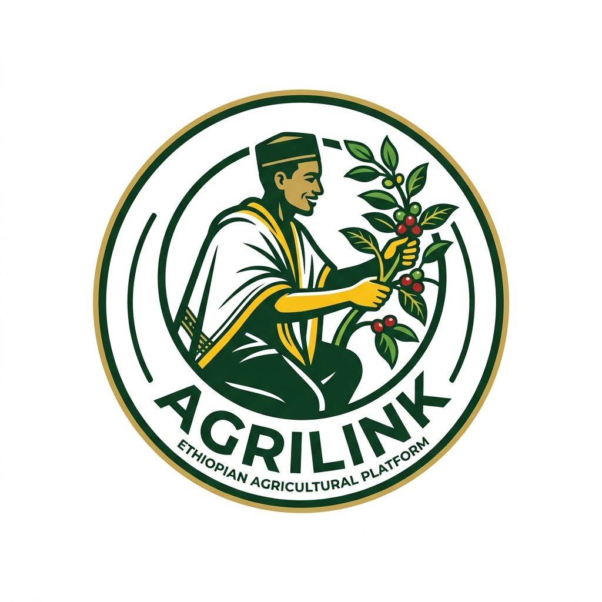
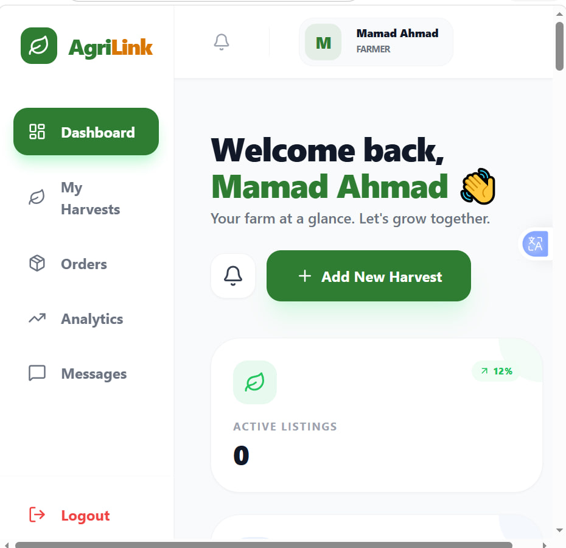
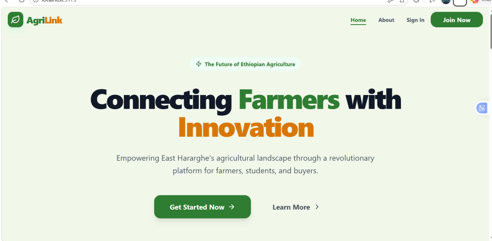
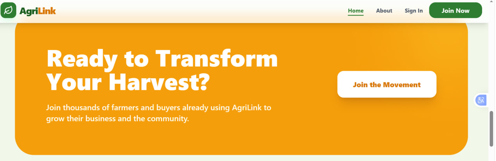
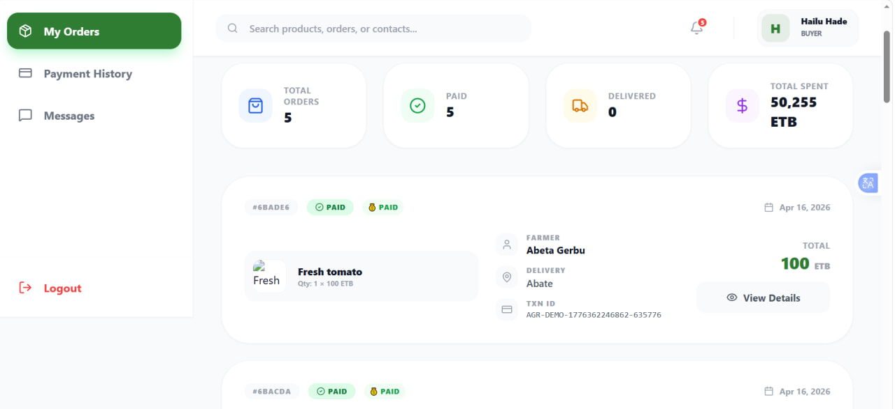
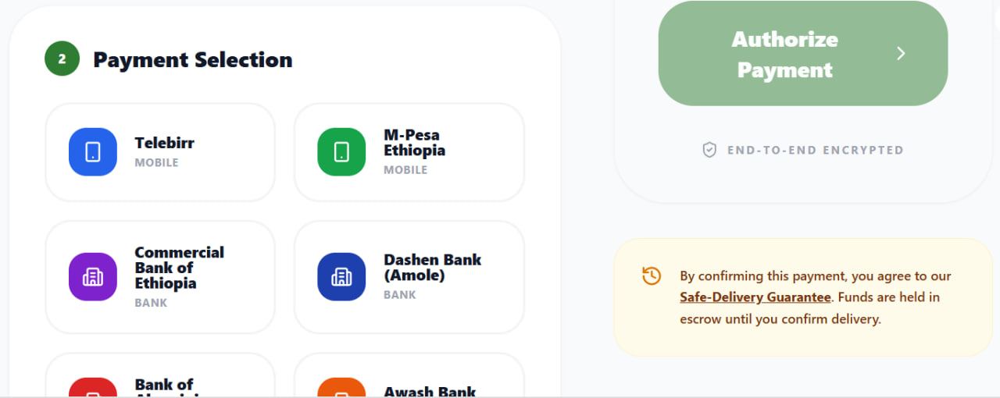
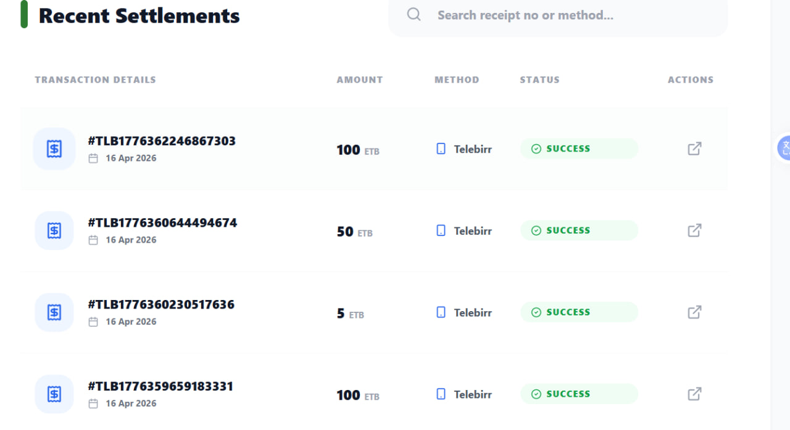

# 🌾 AgriLink - AI-Powered East Hararghe Marketplace



[](https://reactjs.org/)
[](https://nodejs.org/)
[](https://www.python.org/)
[](https://flask.palletsprojects.com/)
[](https://web.dev/progressive-web-apps/)

**AgriLink** is a production-grade, AI-powered agricultural marketplace specifically designed for the **East Hararghe** region of Ethiopia. It connects farmers, university students, and buyers through a smart, multilingual, and mobile-first platform.

---

## 🚀 Visionary Features

-   **🤖 AI Smart Farming (Flask & Gemini Engine)**:
    -   **Predictive Pricing**: Real-time crop price forecasts based on regional data.
    -   **Multilingual Chatbot**: Trilingual agricultural advice (English, Amharic, Afaan Oromo).
    -   **Crop Vision**: (Beta) AI-driven crop disease diagnosis.
    -   **Auto-Translation Chat**: Real-time translation between farmers and buyers.
-   **🌍 Truly Local Experience**:
    -   **Interactive Market Heatmap**: Live map showing crop prices across 10 Ethiopian markets.
    -   **Delivery Tracking**: Visual status timeline for orders (Processing -> Shipped -> Delivered).
    -   **Multilingual UI**: Fully translated interface (English, Amharic, Afaan Oromo).
    -   **PWA Mobile App**: "Add to Home Screen" support for offline-ready mobile usage.
-   **💳 FinTech Split Payments**: 
    -   Integrated with **Chapa** for automated farmer payouts.
    -   Automatic commission calculation (95% Farmer / 5% Agrilink).
    -   Supports Telebirr, M-Pesa, and CBE bank accounts.
-   **💬 Real-Time Collaboration**: Socket.io powered chat between farmers and buyers.
-   **🎓 Innovation Hub**: Connecting Haramaya University students with real-world farming problems.

---

## 📸 App Showcase

<div align="center">
  <table>
    <tr>
      <td width="50%"></td>
      <td width="50%"></td>
    </tr>
    <tr>
      <td width="50%"></td>
      <td width="50%"></td>
    </tr>
    <tr>
      <td width="50%"></td>
      <td width="50%"></td>
    </tr>
  </table>
</div>

---

## 🛠 Tech Stack

| Layer | Technology |
| :--- | :--- |
| **Frontend** | React 18, Vite, Tailwind CSS, Framer Motion, i18next (Multilingual) |
| **Backend (Core)** | Node.js, Express.js, JWT, Socket.io (Real-time Messaging) |
| **AI Microservice** | Python 3, Flask, RAG-lite Knowledge Base, Predictive Modeling |
| **Database** | MongoDB (Atlas) with Mongoose ODM |
| **Payments** | Chapa (Split Payouts, Telebirr, M-Pesa, CBE) |
| **App Support** | Vite-PWA (Service Workers, Offline Manifest) |

---

## 📂 Project Structure

```bash
agrilink/
├── backend/            # Express.js API (Core Logic)
├── flask_ai/           # Python/Flask AI Microservice (Gemini API Integration)
├── frontend/           # React/Vite PWA (Multilingual UI)
│   ├── public/         # New Branding Icons (Ethiopian Farmer Logo)
│   └── src/locales/    # Translations (English, Amharic, Oromo)
├── render.yaml         # Blueprint for automated 1-click cloud deployment
└── README.md           # Documentation
```

---

## 🏗️ Getting Started

### 1️⃣ AI Engine Setup (Flask)
```bash
cd flask_ai
python -m venv venv
source venv/bin/activate
pip install -r requirements.txt
python app.py
```

### 2️⃣ Backend Setup (Node.js)
```bash
cd backend
npm install
npm run dev
```

### 3️⃣ Frontend Setup (React PWA)
```bash
cd frontend
npm install
npm run dev -- --host
```

---

## 🔐 Environment Variables

### Backend (.env)
```env
PORT=5000
MONGO_URI=mongodb+srv://...
CHAPA_SECRET_KEY=...
PAYMENT_MODE=DEMO # or LIVE
```

### Frontend (.env)
```env
VITE_API_URL=http://your-backend-url
VITE_FLASK_API_URL=http://your-ai-url/api
```

---

## 🌐 Deployment

The project is configured for **1-click automated deployment** using the included `render.yaml` blueprint.

1. Create a [Render.com](https://render.com) account.
2. Click **New** -> **Blueprint**.
3. Connect this GitHub repository.
4. Render will automatically detect the `render.yaml` file and spin up three separate services:
   - Node.js Backend API
   - Flask AI Microservice
   - React Frontend Static Site

| Platform | Role |
| :--- | :--- |
| **Render.com** | Frontend, Backend, & Flask AI Hosting |
| **MongoDB Atlas** | Cloud Database |

---

**Made with 💚 by Kenenisa Boru** — for the Ethiopian Agricultural Renaissance